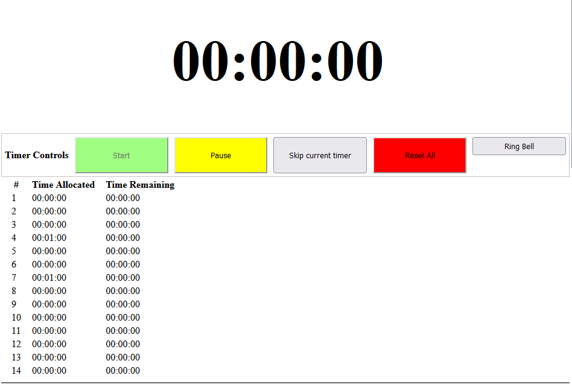

# GRE Exam Timer

Production URL: [https://jjose14-jacob-jose.github.io/gretimer/](https://jjose14-jacob-jose.github.io/gretimer/) 

### What is it? 
HTML timer with specific time slots similar to the GRE examination so that you can simulate exam timing.

### Tech Stack
* JavaScript
* HTML 
* CSS

### Disclaimer
This not related or affiliated to the [ETS&reg; GRE&reg](https://www.ets.org/gre.html);
